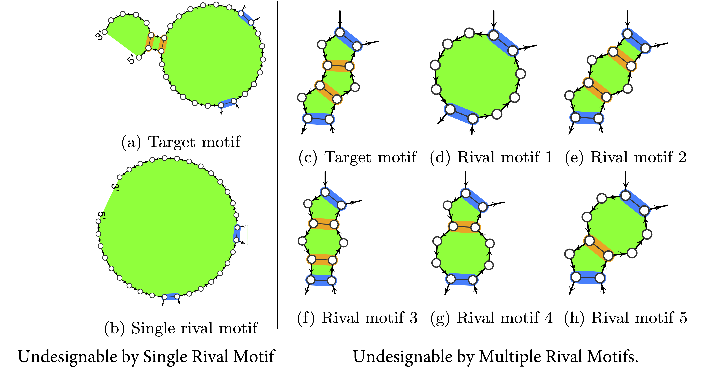
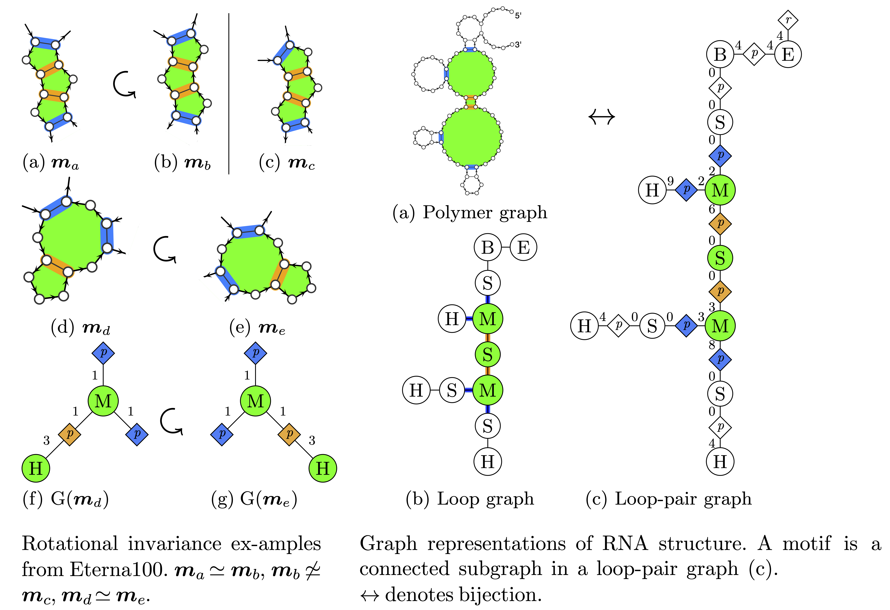

# RNA-Undesign
Algorithms for Identifying the Undesignability of RNA secondary structures

## Introduction

This project explores the undesignability of RNA secondary structures, under the context of RNA design, building upon the research presented in the paper by T. Zhou et al. [1][2].

## References

[1] Zhou, T., Tang, W.Y., Mathews, D.H. and Huang, L. 
"Undesignable RNA Structure Identification via Rival Structure Generation and Structure Decomposition." 
(RECOMB 2024, [arXiv preprint](https://arxiv.org/abs/2311.08339)) \
[2] Zhou, T., Tang, W.Y., Apoorv, M., Mathews, D.H. and Huang, L. 
"Scalable and Interpretable Identification of Minimal Undesignable
RNA Structure Motifs with Rotational Invariance" (under review)

## Datasets
[Eterna100](data/eterna100.csv) \
[ArchiveII](data/archiveii.raw.txt) \
Motifs of length up to 14 (excluding motifs with external loops for comparison with [CountingDesign](https://gitlab.com/htyao/countingdesign)):
- [Designable motifs of length up to 14](data/motifs_maxlen14_no_external/short14_undesignable_dg0.txt)
- [Undesignable motifs of length up to 14](data/motifs_maxlen14_no_external/short14_undesignable_dg0.txt)

## Results
Detailed results for undesignable motifs of length up to 14: 
- [All motifs (4561)](data/motifs_maxlen14_no_external/results.all.csv)
- [Unique motifs (1805) by rotational invariance](data/motifs_maxlen14_no_external/results.uniq.csv)

## Dependencies
- GCC 4.8.5 or above

## Build
### Linux
```
# Test with CentOS
$ make main   
$ make main_nosh  # turn off special hairpins
```
### Mac
```
# Test with Apple Silicon
$ make main_mac   
$ make main_nosh_mac  # turn off special hairpins
```
## Rival Motifs
<p align="center">

</p>

----
## Rotation Invariance

<p align="center">

</p>

## Environment Variables
```
$export OMP_NUM_THREADS=8 # parallel computing eabled by OpenMP
$export PATH_UNDESIGNABLE_LIB=path/to/lib_undesignable.txt
$export PATH_DESIGNABLE_LIB/path/to/motifs/libs/lib_designable.txt
```
## FastMotif 
```
$echo ".((......((......))......((......((......))......((......))......))......))....." | ./bin/main --alg fastmotif
```

## Rival Motifs Search
```
$echo "(.(*)...(..(*)))" | ./bin/main --alg motif # motif as a dot-bracket string where (*) is a boundary pair
```

## RIGEND

### Undesignability Alg1
```
$./bin/main --alg 1
......(.........((((.....)))).........)......................
................((((.....))))................................
```

### Undesignability Alg2
```
$./bin/main --alg 2
AAAAUGAGCCCCACGAAAGGAGAGUGCUCACAAA
....((((((((.(....)).).).)))))....
....(((((((..(....)..).).)))))....
```

### Undesignability Alg2 (constrained)
```
$./bin/main --alg 2c
UUAAGGGAAAAUCUUAGCCGAGAAAUCGGAUCCAAAGCGGCAUAAAAAAGAAAGCGCCGAAAUUCGCAGAAAUGCGAGAAAGGCAAGCAAAGAAUUCGGCAGAAAAAAUGCCGACCGGGCAAUGAAAAUUCGCCCGUGGAGCCAAGCGGG
((((((.....)))))(((((....)))).)((...(((((............(((((....((((((....))))))...)))..)).......((((((.......))))))(((((((((....))).))))).)..)))..)))))
((((((.....))))).((((....))))..((...(((((............(((((....((((((....))))))...)))..)).......((((((.......))))))(((((((((....))).))))).)..)))..)))))
```
### Undesignability Alg3
```
$./bin/main --alg 3
ACUAAAUGGUGAGCAGACCCAGUGGAAACACACGCAGCCGAAAGGUACCCAUCCGAGAGGAAGUCAGGCGAAAGCUAACGGAAAGAACGUAGACAGGGAGCGAGGGACAAAGACUGCAAGGGAAAGUACACAAGACAAAGUAAAAAAAGGUGAGGCAGGGGAAACCCCGGGAAACCGGUCGAAAGACGCCAGCAAACCGCAGAAACAGCCACCCAGCGAGACAGACAAAAGCGGAUACGUAGUCGACGGAAACGUAGUCAGGGGAAACCCACGCAAUCGAAAGAUAGGGAGUCGGUGAAAACCAGAGAAAUCUACUCAAAAGAGGACAGGCAGCGGAACCCCUACACCGAAAAAA
.......((((.((((.(((.(((....))).(((.(((....))).(((.(((....))).(((.(((....))).(((.......))).))).))).))).))).(...).)))).((((...((.(((...((...))........))).(((.(((....)))(((....)))(((....)))))).))...((((.(...).(((.(((.(((.(((.(((....(((....))).))).(((....))).))).(((....))).))).(((....))).))).((((((....)))(((....))).(((....)))))).))).))))...)))).)))).......
```
## Utilities
### Energy Evaluation
``` 
$./bin/main --alg eval
CACACGCACUACAAAAUGUCCAAAGGAAAAGGCACCACCAGCAAAGCACCAAAGGUAAGGGGAAAAG
.....((.((.((...)).((...))...)))).((.((.((...)).((...))...)))).....
(output)total energy: -3.00
```
### Differential positions
```
$./bin/main --alg dp
..((((((((.......(.((((((....)))))).(((((((....))))))).).......))))))))..
..((((((((.........((((((....)))))).(((((((....))))))).........))))))))..
```
### Energy difference
```
$./bin/main --alg ed
GGGAGACCCAAAAAAAAGGGCAACUGCAAAAAGGAGACAGCACCCCGAAAAAAGACUGGAAAAAGGGCGAAAAGCUCGAAAAACACGACCAACGGAAAACAGGACGAAAGAGAACAAGCAAGCCAAAGGGAAACAGACUAAAAACGCGAAAGCGACUGCAAAGGGGGAGAAAAAGCGACCCUGAACGAAAAAGGGGCGAAAAAUUGGAACAAAAAAAGGAGGGGGGAAAGGAAAGUCAAAGACACUCGAAACGAGUGAGCGGGCAAAAAAAAAAACGGGGGAUGAAUAACGGACGGAAACGCGGCGGAAAGCGAAAAAAAGAAAAACGUCGUACGGACUACUGGGGUGCAAAAAAAAGGAGGGGCGCAAAAAGGAAAAAACAGGGUCCACUA
((..(((((........(.((..((.(.....(....).((((((((.........((......((((.....))))......))...((..((.......(..(......)..)..((..((.....(....).((((.....(((.....(..((.(...).))..).....))).((((...(.......(..(.((...)).)..).......)...))))........)))).....((((((...)))))).))..))...........))..)).........(..((....)((((((.....(........).....))))))..)..)...))))))))........).))..)).).....(.......).)))))..)).
((..(((((........(.((..((.(.....(....).((((((((.........((......((((.....))))......))...((..((.......(..(......)..)..((..((............((((.....(((.....(..((.(...).))..).....))).((((...(.......(..(.((...)).)..).......)...))))........)))).....((((((...)))))).))..))...........))..)).........(..((.....((((((.....(........).....)))))).))..)...))))))))........).))..)).).....(.......).)))))..)).
ref1 energy: -68.20
ref2 energy: -72.70
GGGAGACCCAAAAAAAAGGGCAACUGCAAAAAGGAGACAGCACCCCGAAAAAAGACUGGAAAAAGGGCGAAAAGCUCGAAAAACACGACCAACGGAAAACAGGACGAAAGAGAACAAGCAAGCCAAAGGGAAACAGACUAAAAACGCGAAAGCGACUGCAAAGGGGGAGAAAAAGCGACCCUGAACGAAAAAGGGGCGAAAAAUUGGAACAAAAAAAGGAGGGGGGAAAGGAAAGUCAAAGACACUCGAAACGAGUGAGCGGGCAAAAAAAAAAACGGGGGAUGAAUAACGGACGGAAACGCGGCGGAAAGCGAAAAAAAGAAAAACGUCGUACGGACUACUGGGGUGCAAAAAAAAGGAGGGGCGCAAAAAGGAAAAAACAGGGUCCACUA
ref1 energy = 7.20, ref2 energy = 2.70
pass test: true
e1 - e2: 4.50
delta  : 4.50
```
or
```
$./bin/main test_diff  < data/seq_refs.txt # batched input
```
